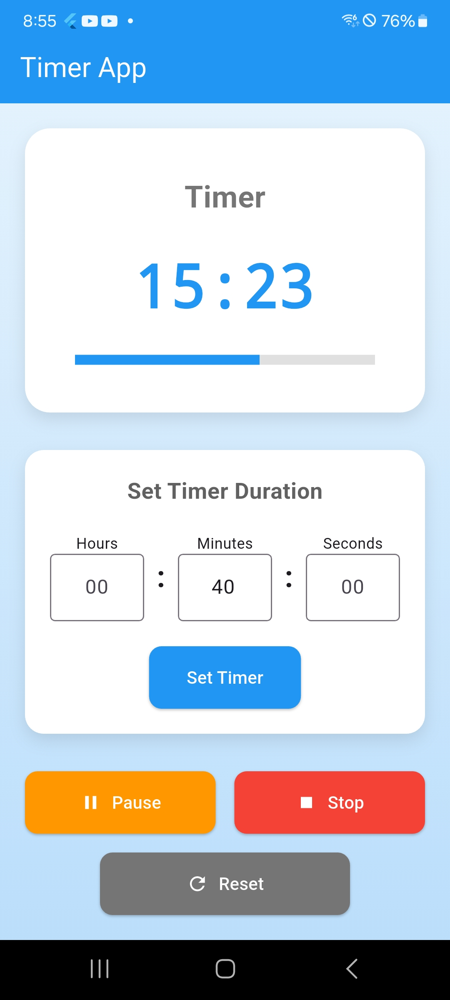

# Wouldn't it be better to set a timer and exercise when the time comes?

I created a simple flutter app with AI.
It doesn't take much time and it's easy to create an app like this.
If you plan more detailed requirements and instructions, you can easily create an app of any size.

